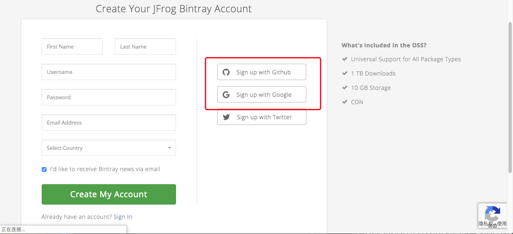
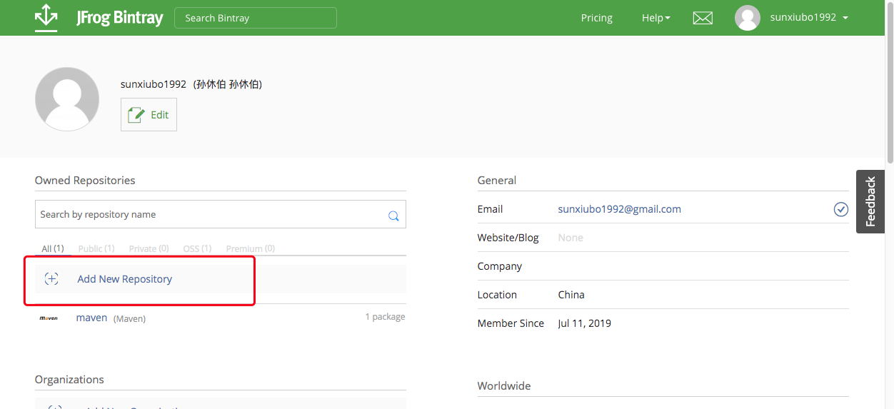
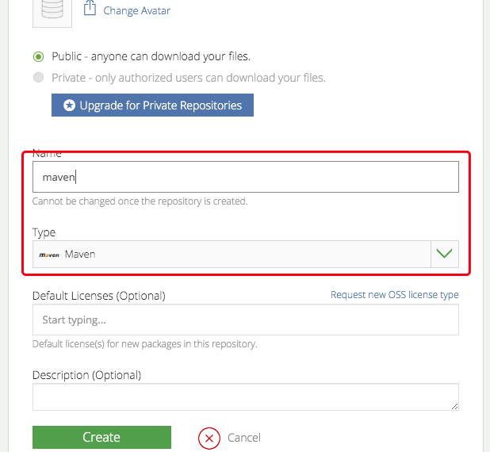
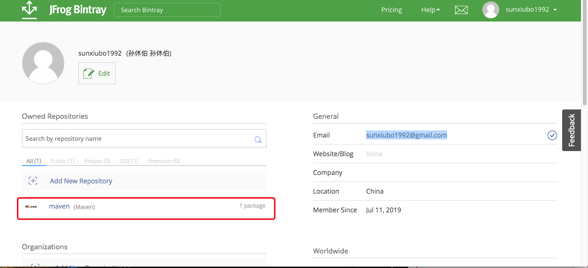
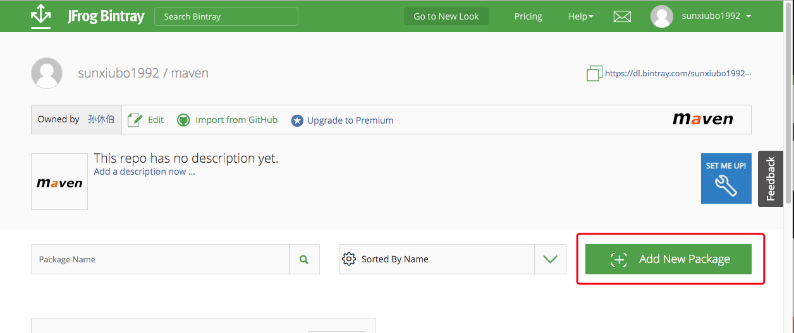
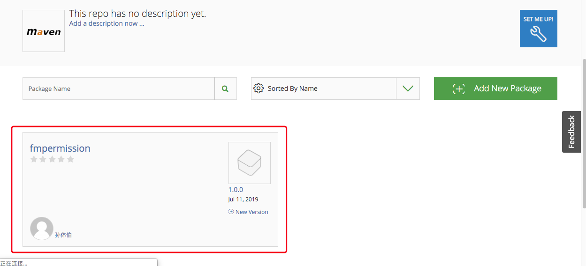
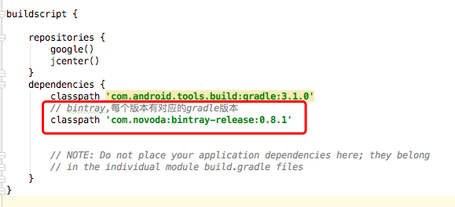
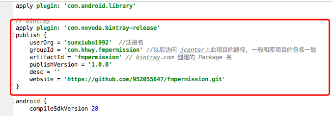
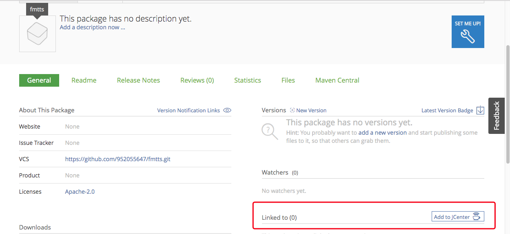
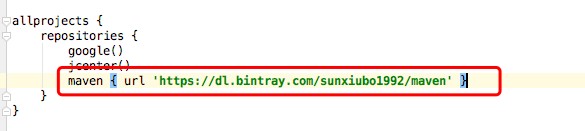

# 发布jcenter流程

## 准备
- android项目
- 需要发布的module（放在android项目下）
- github账号、项目（android项目存放地址，创建package、发布jcenter使用）
- bintray账号、项目（发布jcenter的工具）

## bintray

### 注册
- 打开https://bintray.com/地址，点击如图注册按钮，进入如图界面，使用右侧github或google授权注册，若github为国内邮箱地址，如；qq.com、163.com均不可注册bintray，点击注册会无反应.

### 创建repository
- Add New Repository,如图位置，进行创建repository。

- Create Repository，如图,Type选择”Maven”,Name最好直接填”maven”。如图已完成的仓库。

### 创建package
- Add New Package，进入刚才创建的 Repository，如图，创建 Package。Name 任意,Licences 选择 Apache-2.0,Version control 填入版本管理的地址（github地址）。如图已完成的package。

## 配置
- 打开项目的build.gradle，添加
```
classpath 'com.novoda:bintray-release:0.8.1'
```
，版本可自行控制，且每个bintray版本都有自己对应的gradle版本,对应版本号可以到[bintray-release](https://github.com/novoda/bintray-release/releases)查看
 如图
 

- 打开module的build.gradle，添加
```
apply plugin: 'com.novoda.bintray-release'
publish {
    userOrg = 'sunxiubo1992'  //注册名
    groupId = 'com.hhwy.fmpermission' //以后访问 jcenter上此项目的路径，一般和库项目的包名一致
    artifactId = 'fmpermission' // bintray.com 创建的 Package 名
    publishVersion = '1.0.0'
    desc = ''
    website = 'https://github.com/952055647/fmpermission.git' // android项目版本控制地址
}
```
，如图


## 发布
- 发布bintray命令，
在项目跟目录下打开命令行工具，输入命令
```
./gradlew clean build bintrayUpload -PbintrayUser=BINTRAY_USERNAME -PbintrayKey=BINTRAY_KEY -PdryRun=false
```
其中，BINTRAY_USERNAME为注册的用户名， BINTRAY_KEY为刚刚的API key. 
最后BUILD SUCCESSFUL,aar就上传成功了，可以到自己账号的相关仓库中查看。

- 发布jcenter，
进入package详情，点击如图按钮即可发布，可在bintray网站的消息内查看发布状态。

## gradle引用
- gradle引用规则
```
compile groupId:artifactId:version
```
如仅发布到bintray，未完成jcenter发布使用时，需在项目的build.gradle下添加
```
maven { url 'https://dl.bintray.com/sunxiubo1992/maven' }
```
如图
